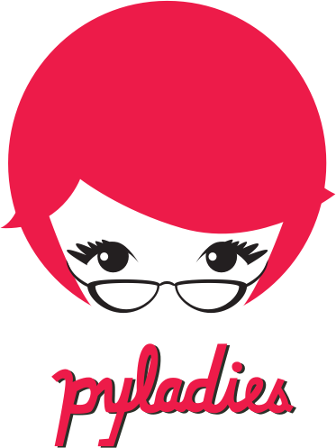

<H1>  
  <em>Hello!</em></H1>

&nbsp;  

Welcome to the Global PyLadies Community Slack Platform. 

Kindly do well to introduce yourself in #introductions with the following information:

- Your name
- The PyLadies chapter you organize or belong to (_if you don't have a local one just say **"PyLadies"!**_)
- Your pronouns (**e.g.** she/hers, they/them)
- Tell us about your involvement with the Python Programming Language!

While you can make posts anywhere on this platform, we encourage you to look for a related channel. We have many available channels, such as those listed below. It may help you engage more effectively by finding the _appropriate_ channel to participate in! 

Some great places to start: 

\#introductions

\#general

\#conferences

\#pyladies-support

\#help-me

Check if your city or region has a channel by searching for your city name or your regional name in the Slack Channels! For example: `#africa` and `#nyc`

If you are a PyLadies Organizer, ask to be added to the private **organizers** channel.

PyLadies aims to provide a friendly support network for our self-identifying members & help build a bridge to the larger Python world.

### We're _thrilled_ to have you here!
