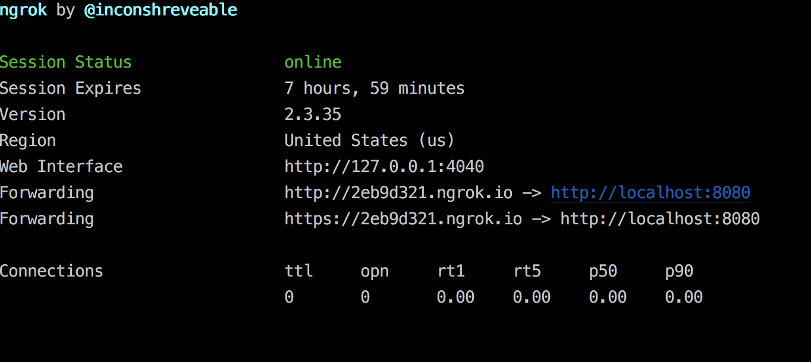

# PyLadies MeetUp Scraper

A Python 3.6+ script, this project both uses the MeetUp API and a GitHub token to create a `pyladies_meetup_chapters.yml`: 

- meetup name
- meetup id
- meetup url
- date of last meetup event
- meetup organizers

### To Run

1. Register [a meetup app](https://secure.meetup.com/meetup_api/oauth_consumers/) and insert the following values in the `.env` file: `MEETUP_CLIENT_ID`, `MEETUP_CLIENT_SECRET`, `MEETUP_REDIRECT_URI`.
2. Add a GitHub token with read privileges into the `.env` file: `GITHUB_TOKEN`.
3. Ensure you have installed the libraries from `requirements.txt` via `pip install -r requirements.txt`.
4. [OPTIONAL] As obtaining a MeetUp access token requires your MeetUp application to use a `redirect_uri`, read the section below for how to setup your own `simple_server.py` for local development.
5. The script is both a bash executable script: `pyladies-meetup-scraper.py` or with `python` using `python pyladies-meetup-scraper.py`.

### Obtaining a MeetUp Access Token in Local Development

Registering [a MeetUp app](https://secure.meetup.com/meetup_api/oauth_consumers/) requires a `redirect_uri' for users to authenticate with  your MeetUp application. If you are working locally, don't fear! We can use `ngrok` and the `simple_server.py` script in this directory to setup a callback url (the `redirect_uri`).

1. Download and install `ngrok` - a Go tool that allows you to map a localhost port to the public internet!
2. In your terminal run `./ngrok http 8080 -host-header="localhost:8080"` from where it is installed
3. Update your MeetUp callback url using the domain `ngrok` provides, or as the image below shows we will use `http://2eb9d321.ngrok.io/callback`. 
4. Run `./simply_server.py`
5. Now you can execute the `pyladies-meetup-scraper.py`!

####  Ngrok Example

### Questions 

Contact `lorena@pyladies.com` or reach out in the PyLadies Slack #organisers-resources channel.