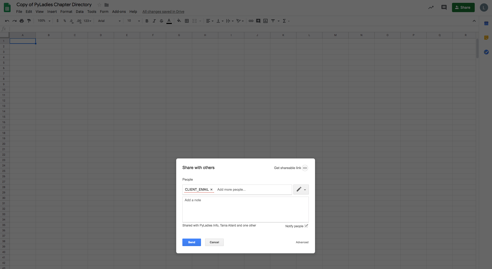

# Chapter Directory

A Python 3.6+ script, this project both uses the Google Drive and Google Sheets API to update the PyLadies Chapter Directory 
and email new chapters (or those missing from directory) the Chapter Directory Survey Form. 

### To Run

1. Select email address you will send emails with, set that value in `.env` for `GMAIL_ACCOUNT_NAME` and `GMAIL_ACCOUNT_PASSWORD`.
2. Obtain credentials for a Google Service Account with access to PyLadies GSuite, set the value in `.env` for the `GOOGLE_CREDENTIALS_FILE`. 
3. Download the latest Google PyLadies users information via the Google PyLadies Admin Console, save into PyLadies Chapter Directory (e.g. `11_11_2019_download`). 
You'll need this sheet name for the script. 
4. There is no Google Forms API, so the entry fields populated were manually obtained by inspecting the Google Form. Google Survey
Forms are only accessible from a `@pyladies.com` Google account.
5. Run `send_surveys.py` or `python send_surveys.py`. 

### To Obtain Google API credentials 

Create a project in the [Google API Console](https://console.developers.google.com/?authuser=0&project=quickstart-1574519279210&pli=1)
- Enable Google Sheets API 
- Enable Google Drive API
- Via the project dash click ["Create Credentials"](https://console.developers.google.com/apis/api/sheets.googleapis.com/overview?project=pyladies-admin) 
  to create a Service Account with at least Editor permissions for your project, download the credentials as `.json`
- On the PyLadies Chapter Directory sheet, invite the `client_email` from the downloaded credentials via `Share -> Share with others -> Send`: 

 ### To Send Emails with Gmail
 
If using Gmail to send email, you will need to:
- Set [`Less secure app access`](https://support.google.com/accounts/answer/6010255)
- Create [Application Password](https://support.google.com/accounts/answer/185833)
    
### Questions 

Contact `lorena@pyladies.com` or reach out in the PyLadies Slack #organisers-resources channel.
